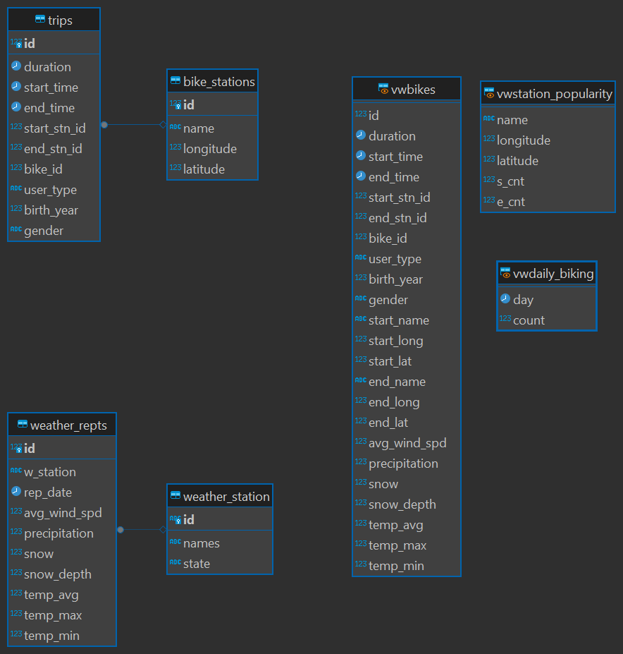
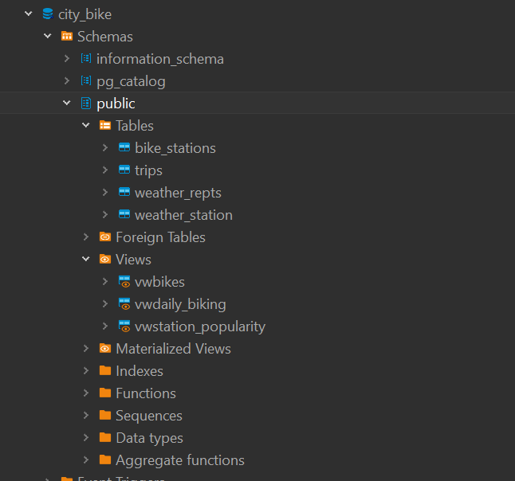

# Codemeys Data Engineer Portolio Project City Bike

### Summery
In this project we load 2 data sets into pandas. One of those data sets is segmented into over 10 files. This is to ensure that we use the glob functionality to load all the data frames and then concatenate them all at once. We then clean the data and design a more normalized structure. After designing the structure we write the DDL and create a data base in postgres. Finally we load the data into the database and create some useful views.

### City Bike data python
[Jupiter-Notebook](./Data_Processing.ipynb)

I first used glob to define a list of files and the iteratively read them into a pandas data frame. I then appended them together with concatenate. Then I explored the data set with various commands like head, summery, count, describe, and value_counts. I replaced some values to make it more clear. I looked at the missing values and decided to drop them as the percentage was very small. I then realized this data was really 2 tables with a 1 to many relationship so i split the tables up to prepare for the insertion.

### Weather data python
This file was pretty clean with 2 exceptions. It had airport name state and country in 1 column I brok this out. I recognized that weather station and weather reports were the 2 tables and so i broke it out. Unfortunately, there is only 1 weather station and so it is kind of a pointless table right now. 

### DDL and load
I wrote the DDL create table statements and executed them on the DB. [sql_file](./City_bike.sql) When I began loading the data into the database this took over 7 minutes with the standard insert method. I decided against this and found that PSYCOPG had released a new version with the copy method where it would copy from stdin on the remote system. I used this and it turned it into less than 20 seconds. The Schema I designed was simply 2 tables but that is because that data only presented itself with 2 unique nouns. I am currently opposed to 2 column tables like a M/F gender table. I would rather the M/F be on the parent table. The weather Tables were very straight forward.

### Database Views
I tried to create the views I thought were important. I though a join of all the data back together was important. To make this view vwbikes I joined state day to the weather day. The reason I thought this was important is because the visualization tools need it all to create slicers and what. I thought it might be nice to know which station was most popular to start and finish at. I also though may be a simple cont per day was a important view

