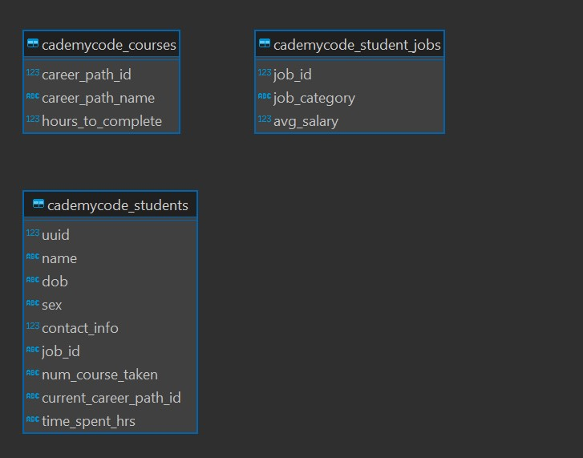

# Cademycode Porfolio Project

This project is intended to demonstrate a data pipeline where data is sorced in a database in this case it was sqlite and loaded into python to perform cleaning operations. The end result was to make a table that lends itself to analitacal tools so joining the tables back together was one task as well as handeling NAs.

The project has the flow of using a shell script to automate the calling of the python script. The Codemey example has it all placed into on file. my thought was to break out the unit testing and the worker class and then use the shell script to call the pytest make a disioin to call the python program and append all information to a single log.

Libreary that are used are as follows.

1. pandas
1. logging
1. sqlalchemy
1. pytest
1. json

The starter db schema is as follows
